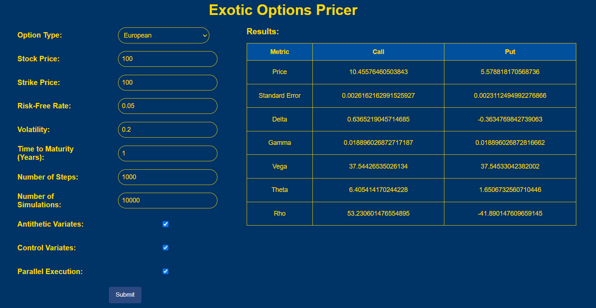
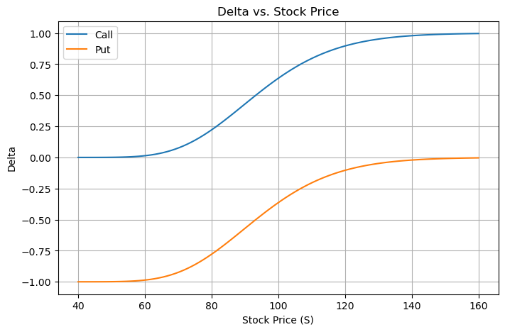
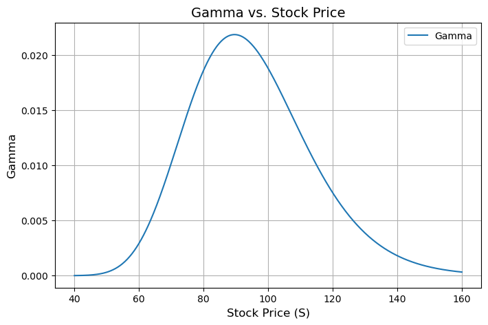
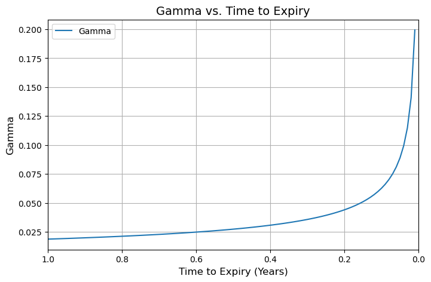
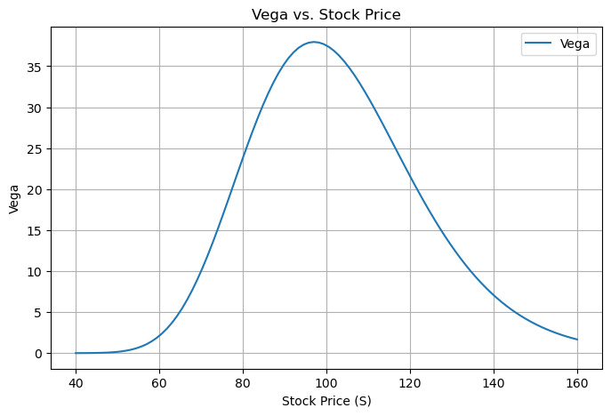
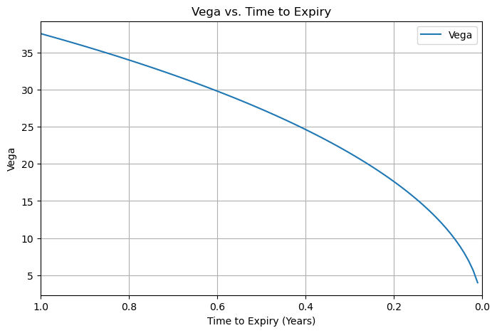
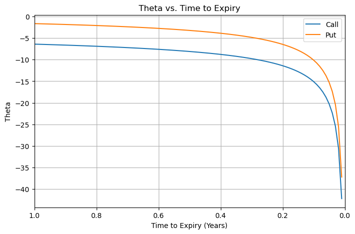
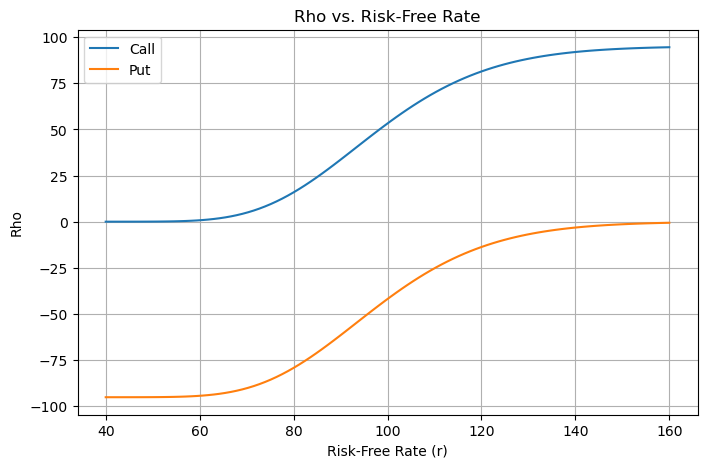

# Exotic Option Monte Carlo Web Application

- [Overview](#overview)
- [Exotic Options](#exotic-options)
  - [Asian](#asian)
  - [Digital](#digital)
  - [Barrier](#barrier)
    - [Up-and-In](#up-and-in)
    - [Up-and-Out](#up-and-out)
    - [Down-and-In](#down-and-in)
    - [Down-and-Out](#down-and-out)
  - [Lookback](#lookback)
  - [Range](#range)
- [Greeks](#greeks)
  - [Delta](#delta)
  - [Gamma](#gamma)
  - [Vega](#vega)
  - [Theta](#theta)
  - [Rho](#rho)
- [Variance Reduction Techniques](#variance-reduction-techniques)
  - [Antithetic Variates](#antithetic-variates)
  - [Control Variates](#control-variates)
- [Multithreading Parallel Execution](#multithreading-parallel-execution)

## Overview
This Exotic Option Monte Carlo Simulation Web App provides a powerful solution for pricing exotic options. Using advanced Monte Carlo simulation techniques, the app accurately calculates the fair value of various exotic options, along with sensitivity measures to assess risk.

Key Features:
- Option Pricing: Calculate the fair value of exotic options such as Asian, Digital, Barrier, Lookback, and Range Option.
- Greeks Calculation: Compute sensitivity measures (Delta, Gamma, Vega, Theta, Rho) to assess risk and performance.
- Variance Reduction Methods: Implement techniques like Antithetic Variates and Delta-Based Control Variates to improve simulation accuracy.
- Multithreading Parallel Execution: Support for parallel processing using multithreading to enhance simulation speed and efficiency.



## Exotic Options
Financial derivatives with complex features and unique payoff structures, differing from standard options such as European or American options. These options require more sophisticated pricing techniques.

### Asian
An Asian option is a type of exotic option where the payoff depends on the average price of the underlying asset over a specific period rather than its price at expiration.

$\text{Call} = \max(\bar{S} - K, 0)$

$\text{Put} = \max(K - \bar{S}, 0)$

### Digital
A digital option, also known as a binary option, is a financial derivative that delivers a fixed, predetermined payout if the price of the underlying asset meets a specific condition relative to the strike price at expiration, such as being above or below a certain threshold.


```math
\text{Call} =
\begin{cases} 
Q, & \text{if } S_T \geq K, \\
0, & \text{if } S_T < K,
\end{cases}
```

```math
\text{Put} =
\begin{cases} 
Q, & \text{if } S_T < K, \\
0, & \text{if } S_T \geq K.
\end{cases}
```

### Barrier
A barrier option is a type of exotic option where the payoff depends not only on the price of the underlying asset at expiration but also on whether the asset price reaches a specified barrier level during the option's life.

#### Up-and-In
```math
\text{Call} = 
\begin{cases} 
\max(S_T - K, 0), & \text{if } S_t \geq B \text{ for some } t \\ 
0, & \text{otherwise} 
\end{cases}
```

```math
\text{Put} = 
\begin{cases} 
\max(K - S_T, 0), & \text{if } S_t \geq B \text{ for some } t \\ 
0, & \text{otherwise} 
\end{cases}
```

#### Up-and-Out

```math
\text{Call} = 
\begin{cases} 
\max(S_T - K, 0), & \text{if } S_t < B \text{ for all } t \\ 
0, & \text{otherwise} 
\end{cases}
```

```math
\text{Put} = 
\begin{cases} 
\max(K - S_T, 0), & \text{if } S_t < B \text{ for all } t \\ 
0, & \text{otherwise} 
\end{cases}
```

#### Down-and-In

```math
\text{Call} = 
\begin{cases} 
\max(S_T - K, 0), & \text{if } S_t \leq B \text{ for some } t \\ 
0, & \text{otherwise} 
\end{cases}
```

```math
\text{Put} = 
\begin{cases} 
\max(K - S_T, 0), & \text{if } S_t \leq B \text{ for some } t \\ 
0, & \text{otherwise} 
\end{cases}
```

#### Down-and-Out

```math
\text{Call} = 
\begin{cases} 
\max(S_T - K, 0), & \text{if } S_t > B \text{ for all } t \\ 
0, & \text{otherwise} 
\end{cases}
```

```math
\text{Put} = 
\begin{cases} 
\max(K - S_T, 0), & \text{if } S_t > B \text{ for all } t \\ 
0, & \text{otherwise} 
\end{cases}
```

### Lookback
A lookback option is an exotic option where the payoff is based on the highest or lowest price of the underlying asset during its lifetime.

$\text{Call} = \max(S_{\text{max}} - K, 0)$

$\text{Put} = \max(K - S_{\text{min}}, 0)$

### Range
A range option is an exotic option where the payoff depends on the difference between the highest and lowest prices of the underlying asset during its lifetime.

$\text{Payoff} = S_{\text{max}} - S_{\text{min}} $


## Greeks
The Greeks are a set of metrics that describe the sensitivity of an option's price to various factors, such as changes in the underlying asset's price, time to expiry, volatility, and interest rates. These metrics are essential for risk management and hedging in options trading.

### Delta
Delta measures the sensitivity of an option's price to changes in the price of the underlying asset.

$\Delta_{\text{call}} = N(d_1)$

$\Delta_{\text{put}} = N(d_1) - 1$



### Gamma
Gamma measures the rate of change of Delta with respect to changes in the price of the underlying asset.

$\Gamma = \dfrac{N'(d_1)}{S \cdot \sigma \cdot \sqrt{T}}$





### Vega
Vega measures the sensitivity of an option's price to changes in the volatility of the underlying asset.

$V = S \cdot N'(d_1) \cdot \sqrt{T}$





### Theta
Theta measures the sensitivity of an option's price to the passage of time, also known as time decay.

$\Theta_{\text{call}} = -\dfrac{S \cdot N'(d_1) \cdot \sigma}{2 \sqrt{T}} - r \cdot K \cdot e^{-rT} \cdot N(d_2)$

$\Theta_{\text{put}} = -\dfrac{S \cdot N'(d_1) \cdot \sigma}{2 \sqrt{T}} + r \cdot K \cdot e^{-rT} \cdot N(-d_2)$



### Rho
Rho measures the sensitivity of an option's price to changes in the risk-free interest rate.

$\rho_{\text{call}} = K \cdot T \cdot e^{-rT} \cdot N(d_2)$

$\rho_{\text{put}} = -K \cdot T \cdot e^{-rT} \cdot N(-d_2)$



### Explanation

$\text{S}:$ The price of the underlying asset

$\text{K}:$ The strike price

$\text{T}:$ Time to expiry (in years)

$\text{r}:$ The risk-free interest rate

$\sigma:$ Volatility of the underlying asset

$N(d):$ The cumulative distribution function of the standard normal distribution

$N^{\prime}(d):$ The probability density function of the standard normal distribution

$d_1 = \dfrac{\ln(S / K) + (r + 0.5 \sigma^2) T}{\sigma \sqrt{T}}$

$d_2 = d_1 - \sigma \sqrt{T}$


## Variance Reduction Techniques
Variance reduction techniques are methods used to minimize the variance of results in simulations. These techniques aim to improve the accuracy of the estimates by reducing the variance, which leads to more stable and reliable outcomes. By reducing the uncertainty associated with simulations, variance reduction helps in obtaining more precise trustworthy results for pricing options.

### Antithetic Variates
Antithetic Variance Reduction is a technique used in Monte Carlo simulations to reduce variance and improve the accuracy of option price. The key idea is to reduce variance in the estimation by introducing negatively correlated random variables, thus leading to a more stable and accurate result.

1. The expressions below are  geometric Brownian motion and an anti-correlated path assuming the same normal random value.

  - $S_{t + \Delta t} = S_t e^{(r - \frac{\sigma^2}{2})dt + \sigma \sqrt{dt} \epsilon}$

  - $S_{t + \Delta t} = S_t e^{(r - \frac{\sigma^2}{2})dt - \sigma \sqrt{dt} \epsilon}$

2. Having generated two sets of paths, we take the average of the payoffs to calculate the option price.

  - $\text{Price}_{\text{antithetic}} = \frac{1}{2} \left[\left[\frac{\sum_{i=1}^{M} X_i}{M}\right] + \left[\frac{\sum_{i=1}^{M} -X_i}{M}\right]\right] e^{-rT}$

### Control Variates

Simulate M sample paths and compute M potential discounted payoffs, denoted by $\bar{X}$. The standard Monte Carlo estimation formula is:

$\text{Price} = \bar{X} = \dfrac{\sum_{i=1}^M X_i}{M}$

The concept of control variates involves using M sample paths to price another derivative, $Y$ (representing delta), which is correlated to $X$.

$\beta = \dfrac{\text{Cov}(X, Y)}{\text{Var}(Y)}$

The new control variate estimation for the price is:

$Price = \bar{X} - \beta \times (Y_i - \bar{Y})$

## Multithreading Parallel Execution
What is Multithreading?

Multithreading is a technique used in computing which allows the CPU to manage multiple tasks at once. This is especially useful in applications where tasks can be broken down into smaller, independent parts that can be processed simultaneously.

Why Use Multithreading?

1. Improved Performance:  
  By dividing tasks into smaller, parallelizable pieces, multithreading allows your application to take advantage of multi-core processors, significantly reducing the time required to complete computationally intensive tasks.  

2. Efficiency:  
  Multithreading enables an application to handle multiple requests or processes at the same time, improving responsiveness and overall efficiency. For example, during simulations, multiple threads can process simulations independently, making the application more efficient.

3. Resource Management:  
  Multithreading optimizes resource usage by dividing work into parallel tasks, allowing resources like memory and processing power to be utilized more effectively.
